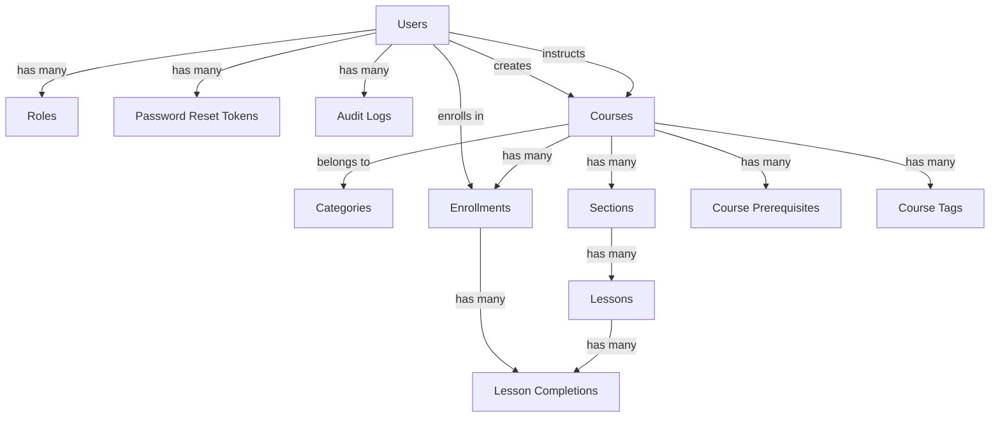

# Advanced LMS Database Schema

## Phase 1: Authentication Schema

### Users Table
```sql
CREATE TABLE users (
  id UUID PRIMARY KEY DEFAULT gen_random_uuid(),
  email VARCHAR(255) NOT NULL UNIQUE,
  username VARCHAR(255) NOT NULL UNIQUE,
  password_hash VARCHAR(255) NOT NULL,
  first_name VARCHAR(255) NOT NULL,
  last_name VARCHAR(255) NOT NULL,
  profile_picture_url VARCHAR(255),
  bio TEXT,
  role_id UUID NOT NULL REFERENCES roles(id),
  is_email_verified BOOLEAN DEFAULT false,
  email_verification_token VARCHAR(255),
  is_active BOOLEAN DEFAULT true,
  last_login TIMESTAMP,
  deleted_at TIMESTAMP,
  created_at TIMESTAMP NOT NULL DEFAULT NOW(),
  updated_at TIMESTAMP NOT NULL DEFAULT NOW()
);

INDEXES: email, username, role_id
```

### Roles Table
```sql
CREATE TABLE roles (
  id UUID PRIMARY KEY DEFAULT gen_random_uuid(),
  name VARCHAR(50) NOT NULL UNIQUE,
  permissions JSONB NOT NULL,
  created_at TIMESTAMP NOT NULL DEFAULT NOW(),
  updated_at TIMESTAMP NOT NULL DEFAULT NOW()
);
```

### Password Reset Tokens Table
```sql
CREATE TABLE password_reset_tokens (
  id UUID PRIMARY KEY DEFAULT gen_random_uuid(),
  user_id UUID NOT NULL REFERENCES users(id),
  token VARCHAR(255) NOT NULL,
  expires_at TIMESTAMP NOT NULL,
  used_at TIMESTAMP,
  created_at TIMESTAMP NOT NULL DEFAULT NOW()
);
```

### Audit Logs Table
```sql
CREATE TABLE audit_logs (
  id UUID PRIMARY KEY DEFAULT gen_random_uuid(),
  user_id UUID REFERENCES users(id),
  action VARCHAR(100) NOT NULL,
  resource_type VARCHAR(100) NOT NULL,
  resource_id UUID,
  changes JSONB,
  ip_address VARCHAR(45),
  user_agent TEXT,
  created_at TIMESTAMP NOT NULL DEFAULT NOW()
);
```

## Phase 2: Course Management Schema

### Categories Table
```sql
CREATE TABLE categories (
  id UUID PRIMARY KEY DEFAULT gen_random_uuid(),
  name VARCHAR(255) NOT NULL UNIQUE,
  slug VARCHAR(255) NOT NULL UNIQUE,
  description TEXT,
  icon_url VARCHAR(255),
  display_order INTEGER DEFAULT 0,
  created_at TIMESTAMP NOT NULL DEFAULT NOW(),
  updated_at TIMESTAMP NOT NULL DEFAULT NOW()
);

INDEXES: name, slug, display_order
```

### Courses Table
```sql
CREATE TABLE courses (
  id UUID PRIMARY KEY DEFAULT gen_random_uuid(),
  title VARCHAR(255) NOT NULL,
  slug VARCHAR(255) NOT NULL UNIQUE,
  description TEXT NOT NULL,
  content TEXT,
  thumbnail_url VARCHAR(255),
  instructor_id UUID NOT NULL REFERENCES users(id),
  category_id UUID NOT NULL REFERENCES categories(id),
  status VARCHAR(20) DEFAULT 'draft' CHECK (status IN ('draft', 'published', 'archived')),
  visibility VARCHAR(20) DEFAULT 'public' CHECK (visibility IN ('public', 'private', 'restricted')),
  is_featured BOOLEAN DEFAULT false,
  difficulty_level VARCHAR(20) DEFAULT 'beginner' CHECK (difficulty_level IN ('beginner', 'intermediate', 'advanced')),
  language VARCHAR(10) DEFAULT 'en',
  price DECIMAL(10, 2) DEFAULT 0.00,
  prerequisites JSONB DEFAULT '[]',
  required_score INTEGER DEFAULT 0,
  allow_retake BOOLEAN DEFAULT true,
  max_attempts INTEGER,
  estimated_hours DECIMAL(10, 2),
  tags JSONB DEFAULT '[]',
  meta_description VARCHAR(500),
  meta_keywords VARCHAR(500),
  created_by UUID NOT NULL REFERENCES users(id),
  updated_by UUID NOT NULL REFERENCES users(id),
  published_at TIMESTAMP,
  deleted_at TIMESTAMP,
  created_at TIMESTAMP NOT NULL DEFAULT NOW(),
  updated_at TIMESTAMP NOT NULL DEFAULT NOW()
);

INDEXES: title, slug, instructor_id, category_id, status, created_at
```

### Sections Table
```sql
CREATE TABLE sections (
  id UUID PRIMARY KEY DEFAULT gen_random_uuid(),
  course_id UUID NOT NULL REFERENCES courses(id),
  title VARCHAR(255) NOT NULL,
  description TEXT,
  display_order INTEGER DEFAULT 0,
  created_at TIMESTAMP NOT NULL DEFAULT NOW(),
  updated_at TIMESTAMP NOT NULL DEFAULT NOW()
);

INDEXES: course_id, display_order
```

### Lessons Table
```sql
CREATE TABLE lessons (
  id UUID PRIMARY KEY DEFAULT gen_random_uuid(),
  section_id UUID NOT NULL REFERENCES sections(id),
  title VARCHAR(255) NOT NULL,
  description TEXT,
  content TEXT,
  lesson_type VARCHAR(20) DEFAULT 'text' CHECK (lesson_type IN ('video', 'document', 'quiz', 'assignment', 'text')),
  video_url VARCHAR(500),
  video_provider VARCHAR(20) CHECK (video_provider IN ('youtube', 'vimeo', 'self_hosted')),
  self_hosted_video_path VARCHAR(500),
  document_paths JSONB DEFAULT '[]',
  external_links JSONB DEFAULT '[]',
  markdown_content TEXT,
  display_order INTEGER DEFAULT 0,
  duration_minutes INTEGER,
  is_published BOOLEAN DEFAULT false,
  requires_completion BOOLEAN DEFAULT true,
  created_at TIMESTAMP NOT NULL DEFAULT NOW(),
  updated_at TIMESTAMP NOT NULL DEFAULT NOW()
);

INDEXES: section_id, display_order
```

### Enrollments Table
```sql
CREATE TABLE enrollments (
  id UUID PRIMARY KEY DEFAULT gen_random_uuid(),
  user_id UUID NOT NULL REFERENCES users(id),
  course_id UUID NOT NULL REFERENCES courses(id),
  enrolled_at TIMESTAMP DEFAULT NOW(),
  completion_percentage DECIMAL(5, 2) DEFAULT 0.00,
  status VARCHAR(20) DEFAULT 'active' CHECK (status IN ('active', 'completed', 'dropped')),
  completed_at TIMESTAMP,
  certificate_id UUID,
  last_accessed_at TIMESTAMP,
  created_at TIMESTAMP NOT NULL DEFAULT NOW(),
  updated_at TIMESTAMP NOT NULL DEFAULT NOW(),
  UNIQUE (user_id, course_id)
);

INDEXES: user_id, course_id, status, created_at
```

### Lesson Completions Table
```sql
CREATE TABLE lesson_completions (
  id UUID PRIMARY KEY DEFAULT gen_random_uuid(),
  user_id UUID NOT NULL REFERENCES users(id),
  lesson_id UUID NOT NULL REFERENCES lessons(id),
  enrollment_id UUID NOT NULL REFERENCES enrollments(id),
  completed_at TIMESTAMP DEFAULT NOW(),
  time_spent_minutes INTEGER DEFAULT 0,
  notes TEXT,
  created_at TIMESTAMP NOT NULL DEFAULT NOW(),
  UNIQUE (user_id, lesson_id, enrollment_id)
);

INDEXES: user_id, lesson_id, completed_at
```

### Course Prerequisites Table
```sql
CREATE TABLE course_prerequisites (
  id UUID PRIMARY KEY DEFAULT gen_random_uuid(),
  course_id UUID NOT NULL REFERENCES courses(id),
  prerequisite_course_id UUID NOT NULL REFERENCES courses(id),
  min_completion_percentage INTEGER DEFAULT 100,
  created_at TIMESTAMP NOT NULL DEFAULT NOW()
);

INDEXES: course_id, prerequisite_course_id
```

### Course Tags Table
```sql
CREATE TABLE course_tags (
  id UUID PRIMARY KEY DEFAULT gen_random_uuid(),
  course_id UUID NOT NULL REFERENCES courses(id),
  tag VARCHAR(100) NOT NULL,
  created_at TIMESTAMP NOT NULL DEFAULT NOW()
);

INDEXES: course_id, tag
```

## Entity Relationship Diagram



## Key Relationships

### User-Course Relationships
- **One-to-Many**: A user can create many courses
- **One-to-Many**: A user can instruct many courses
- **Many-to-Many**: Users can enroll in many courses through the enrollments table

### Course Structure
- **One-to-Many**: A course has many sections
- **One-to-Many**: A section has many lessons
- **One-to-Many**: A course belongs to one category

### Progress Tracking
- **One-to-Many**: An enrollment has many lesson completions
- **Many-to-One**: Lesson completions belong to one lesson and one enrollment

### Additional Relationships
- **Many-to-Many**: Courses can have multiple prerequisites through course_prerequisites
- **One-to-Many**: Courses can have multiple tags through course_tags

## Data Types and Constraints

### UUIDs
All primary keys use UUIDs (Universally Unique Identifiers) for security and distributed system compatibility.

### Enums
The schema uses enums for fixed sets of values:
- Course status: 'draft', 'published', 'archived'
- Course visibility: 'public', 'private', 'restricted'
- Difficulty level: 'beginner', 'intermediate', 'advanced'
- Lesson types: 'video', 'document', 'quiz', 'assignment', 'text'
- Video providers: 'youtube', 'vimeo', 'self_hosted'
- Enrollment status: 'active', 'completed', 'dropped'

### JSONB Fields
JSONB fields are used for flexible data structures:
- `prerequisites`: Array of course IDs
- `tags`: Array of strings
- `document_paths`: Array of file paths
- `external_links`: Array of objects with title and URL
- `permissions`: Array of permission strings (in roles table)
- `changes`: Audit log changes data

### Soft Deletes
Tables that support soft deletion include a `deleted_at` timestamp:
- Users
- Courses

### Timestamps
All tables include `created_at` and `updated_at` timestamps for tracking record creation and modification.

## Indexing Strategy

### Performance Optimization
The schema includes strategic indexes for query performance:
- Foreign key indexes for join operations
- Frequently queried columns (title, slug, status)
- Unique constraints for data integrity
- Composite indexes for common query patterns

### Unique Constraints
- Email and username uniqueness in users
- Course slug uniqueness
- Category name and slug uniqueness
- User-course enrollment uniqueness
- User-lesson-enrollment uniqueness in lesson completions

## Database Migration Strategy

### Version Control
Database migrations are version-controlled and follow a sequential numbering pattern:
- `YYYYMMDDHHMMSS-description.js` format
- Sequential execution order
- Up and down migration functions

### Migration Process
1. Create new migration files for schema changes
2. Run migrations in order using Sequelize
3. Seed initial data for development
4. Update documentation

### Example Migration
```javascript
module.exports = {
  up: async (queryInterface, Sequelize) => {
    await queryInterface.createTable('categories', {
      id: {
        type: Sequelize.UUID,
        defaultValue: Sequelize.UUIDV4,
        primaryKey: true
      },
      name: {
        type: Sequelize.STRING,
        allowNull: false,
        unique: true
      },
      // ... other fields
      created_at: {
        type: Sequelize.DATE,
        allowNull: false
      },
      updated_at: {
        type: Sequelize.DATE,
        allowNull: false
      }
    });
  },

  down: async (queryInterface, Sequelize) => {
    await queryInterface.dropTable('categories');
  }
};
```

## Data Validation

### Backend Validation
- Sequelize model validation
- Joi schema validation for API requests
- Database constraints (NOT NULL, UNIQUE, CHECK)

### Frontend Validation
- Form validation using React Hook Form
- Client-side validation before API calls
- Error handling and user feedback

## Security Considerations

### Data Protection
- Password hashing with bcrypt (10 rounds)
- JWT token encryption
- HTTPS for all communications
- Input sanitization

### Access Control
- Role-based access control (RBAC)
- Permission-based authorization
- Ownership checks for resource access

### Audit Trail
- Comprehensive audit logging
- User action tracking
- Resource change history

## Performance Considerations

### Query Optimization
- Proper indexing strategy
- Eager loading for associations
- Query batching
- Pagination for list endpoints

### Caching
- Redis caching for frequent queries
- Response caching for public data
- Token blacklisting via Redis

### Scalability
- Connection pooling
- Read replicas for reporting
- Horizontal scaling readiness

## Backup and Recovery

### Backup Strategy
- Regular database backups
- Point-in-time recovery capability
- Backup verification procedures

### Disaster Recovery
- Multi-region deployment readiness
- Failover procedures
- Data replication

## Monitoring and Maintenance

### Database Monitoring
- Query performance monitoring
- Index usage analysis
- Table size monitoring

### Maintenance Tasks
- Regular index optimization
- Vacuum and analyze operations
- Database health checks

## Future Extensions

### Planned Schema Additions
- Certificates table for course completion
- Quizzes and assignments tables
- Course reviews and ratings
- User notifications
- Payment transactions
- Learning paths and collections

### Scalability Enhancements
- Database sharding
- Read/write separation
- Advanced caching strategies
- Microservices architecture

This comprehensive database schema provides a solid foundation for the Advanced LMS platform, supporting all Phase 2 features including course management, enrollment system, lesson structure, and progress tracking.